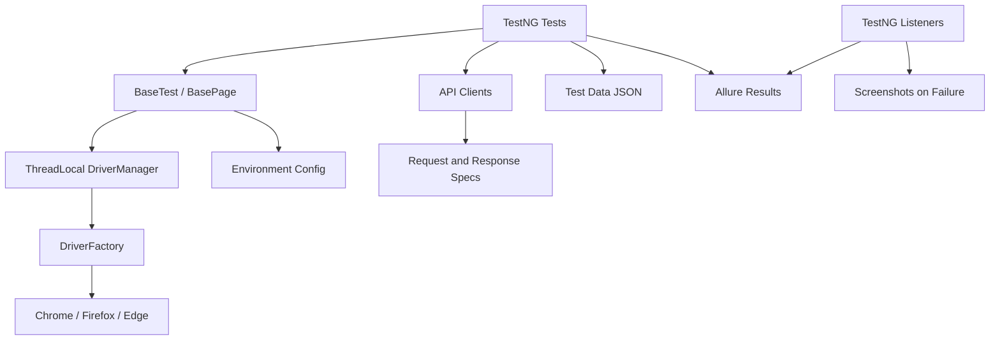

# TestMu SDET-2 Hybrid Automation Framework

Production-style Java 21 automation framework for an e-commerce regression suite covering UI, API, and integration flows.

## Architecture



## Tech Stack

- Java 21
- Maven
- Selenium WebDriver
- TestNG
- Rest Assured
- WebDriverManager
- Jackson
- Allure Reports
- SLF4J + Log4j2
- GitHub Actions
- Docker

## Project Structure

```text
src/main/java
├── api
├── base
├── config
├── driver
├── listeners
├── models
├── pages
└── utils

src/test/java
├── api
├── dataproviders
├── integration
└── ui
```

## Configuration

Default config lives in:

```text
src/main/resources/config/environment.properties
src/main/resources/config/qa.properties
src/main/resources/config/uat.properties
src/main/resources/config/prod.properties
```

Override at runtime:

```bash
mvn clean test -Denv=qa -Dbrowser=chrome -Dheadless=true
mvn clean test -Dbase.ui.url=https://your-app.example -Dbase.api.url=https://api.your-app.example
```

The checked-in QA profile uses public demo targets so the framework is concrete. For a real submission run, point `base.ui.url`, `base.api.url`, and credentials at the assigned TestMu/e-commerce environment.

## Running Tests

Run everything:

```bash
mvn clean test
```

Run API only:

```bash
mvn clean test -DsuiteXmlFile=src/test/resources/suites/api-suite.xml
```

Run UI only:

```bash
mvn clean test -DsuiteXmlFile=src/test/resources/suites/ui-suite.xml -Dbrowser=chrome -Dheadless=true
```

Run smoke:

```bash
mvn clean test -DsuiteXmlFile=src/test/resources/suites/smoke-suite.xml
```

Run by TestNG group:

```bash
mvn clean test -Dgroups=api
mvn clean test -Dgroups=ui
mvn clean test -Dgroups=integration
```

## Allure Reporting

Generate and open a local report:

```bash
allure serve allure-results
```

Captured artifacts:

- screenshots on UI failure
- API request and response details through `allure-rest-assured`
- TestNG metadata, severity, epic, feature, and step annotations
- framework logs in `logs/automation.log`

## Browser Execution

Supported browsers:

- Chrome
- Firefox
- Edge

Examples:

```bash
mvn clean test -Dbrowser=chrome -Dheadless=false
mvn clean test -Dbrowser=firefox -Dheadless=true
mvn clean test -Dbrowser=edge -Dheadless=true
```

## Docker Execution

```bash
docker compose up --build
```

Docker mounts `allure-results` and `screenshots` back to the host.

## CI/CD

GitHub Actions workflow:

```text
.github/workflows/automation.yml
```

It runs on push and pull request, caches Maven dependencies, runs API/UI/integration jobs, executes UI tests in a browser matrix, and publishes Allure/screenshot/log artifacts.

CI/CD was selected over a dashboard because the assignment asks for signal that teams can trust immediately. A reliable pull-request quality gate is the fastest path to preventing bad builds from reaching shared environments.

## Design Decisions

- Page Object Model keeps selectors and UI mechanics out of tests.
- `ThreadLocal<WebDriver>` supports parallel TestNG execution safely.
- Driver factory centralizes browser creation and headless behavior.
- JSON test data keeps data changes separate from test logic.
- Rest Assured request/response specs standardize API validation.
- Retry analyzer is conservative and configurable to avoid hiding real defects.
- Allure provides failure artifacts that make triage faster.

## Scaling Strategy

- Add service-specific API clients rather than raw Rest Assured calls in tests.
- Split suites by ownership: smoke, checkout, catalog, contract, integration.
- Run API and contract tests on every PR; run full UI regression nightly.
- Tag flaky tests and quarantine only with a tracked defect.
- Add visual or accessibility checks as separate quality gates.

## Future Improvements

- Replace demo URLs with the assigned application environment.
- Add contract tests from OpenAPI specifications.
- Add test analytics trend dashboard from Allure history.
- Add Slack or Teams notifications for CI failures.
- Add dynamic test data setup and cleanup through admin APIs.
